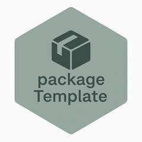

# packageTemplate

# packageTemplate <a href="https://maryleneh.github.io/packageTemplate/"></a>

<!-- badges: start -->
<!-- badges: end -->

The goal of packageTemplate is to ...

## Installation

You can install the development version of packageTemplate like so:

``` r
# FILL THIS IN! HOW CAN PEOPLE INSTALL YOUR DEV PACKAGE?
```

## Example

This is a basic example which shows you how to solve a common problem:

``` r
library(packageTemplate)
## basic example code
```

